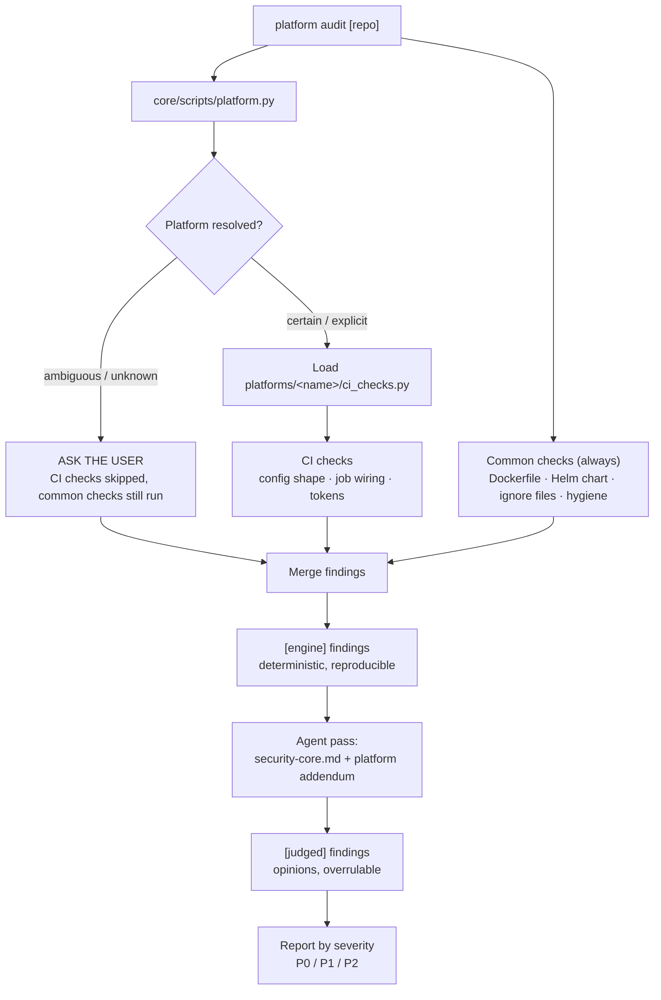
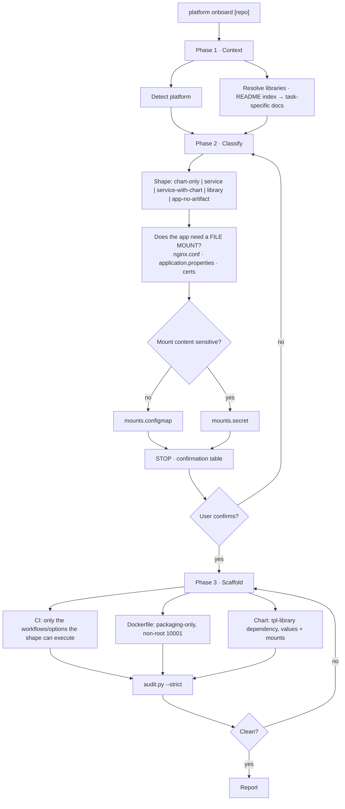

# Platform Builder — GitLab CI, GitHub Actions, Docker & Helm (`platform-builder`)

One skill for CI pipelines, packaging-only Dockerfiles, and Helm charts across **both**
platforms. It detects which platform a repository targets, then loads only that platform's rules.

**Why unified:** the Docker and Helm contracts are identical regardless of CI platform — only the
CI layer differs. Measured against the two standalone skills it replaces:

| Component | Platform-agnostic | Platform-specific |
| --- | --- | --- |
| Rule engine | **62%** — Dockerfile, chart, ignore files, hygiene | 38% — CI config, job wiring, tokens |
| Project detection | **98%** | 2% |

Keeping that shared 62% in two places had already cost something concrete: the standalone GitHub
engine checked workflows **only**, so a repository with a Dockerfile and a Helm chart had neither
audited. The unified harness runs the common checks on every platform, closing that by
construction.

---

## 1. Quick Start & Command Suite

```bash
# 0. Which platform is this repository on?
python3 core/scripts/platform.py /path/to/repo

# 0b. Which copy of each shared library will this run read?  (see section 2.1)
python3 core/scripts/libraries.py /path/to/repo --platform gitlab

# 1. Onboarding: CI pipeline, packaging Dockerfile, and Helm chart
#    (agent-driven -- see SKILL.md §2.1 for the interactive protocol)

# 2. Read-only compliance audit across CI, Docker, and Helm chart
python3 core/scripts/audit.py /path/to/repo

# 3. Strict mode -- fail on P1/P2 as well as P0
python3 core/scripts/audit.py /path/to/repo --strict

# 4. Force a platform (skips detection) and emit machine-readable output
python3 core/scripts/audit.py /path/to/repo --platform github --json

# 5. Audit against specific library sources -- local path, or git URL with a ref
python3 core/scripts/audit.py /path/to/repo \
  --github-ci-library /Users/me/library/github-ci-library \
  --helm-tpl-library https://github.com/grootan-devops/helm-tpl-library/tree/dev
```

Exit codes: `0` clean · `1` `--strict` with P1/P2 · `2` any P0.
Requires Python 3.9+ and PyYAML.

| Command | Purpose |
| --- | --- |
| `platform onboard [repo]` | Scaffold CI, Dockerfile, and chart for a repo that has none |
| `platform update [repo]` | Migrate to current standards, applying only what is required |
| `platform ship [repo] <env>` | Add deployment wiring for a target environment |
| `platform audit [repo]` | Read-only compliance and security audit |

---

## 2. Reference Libraries

The skill carries **no copy** of what these libraries do. It reads their indexes and selected
topic guides at the resolved version, because they are the authority on their own behaviour.

| Library | Provides | Read for |
| --- | --- | --- |
| `gitlab-ci-library` | GitLab CI template modules | `WORKFLOW` options, job/stage tables, publishing & auth |
| `github-ci-library` | GitHub reusable workflows | module catalog, scenario files, execution matrix |
| `helm-tpl-library` | `tpl-library` Helm library chart | values contract, mounts schema, template helpers |

Each ships a `README.md` index (required) and usually a `MIGRATION.md`. Read the index at the
resolved ref, then only its topic links relevant to the task. Follow relative links from
their containing page and keep the same checkout/ref throughout. Local sources include
uncommitted docs; explicit refs override the configured `main` default. Older versions may
use a monolithic README: read its relevant sections. Read migration sections for upgrades
and compatibility checks, not on every run. Do not preload the whole docs tree.

### 2.1 Choosing which copy

```bash
python3 core/scripts/libraries.py /path/to/repo --platform gitlab
python3 core/scripts/libraries.py /path/to/repo --all --json
```

Each library has its own flag; `--lib NAME=SOURCE` is the generic equivalent.

```bash
# local working copy -- read in place, uncommitted changes included
--github-ci-library /Users/me/library/github-ci-library

# the web URL from a browser address bar, at a branch or a commit
--github-ci-library https://github.com/grootan-devops/github-ci-library/tree/dev
--gitlab-ci-library https://github.com/grootan-devops/gitlab-ci-library/tree/e7c31d0c6a4a

# git URL at a tag / branch / commit
--helm-tpl-library https://github.com/grootan-devops/helm-tpl-library@1.0.0

# scp-style URLs work; only an '@' after the last '/' is a ref
--helm-tpl-library git@github.com:grootan-devops/helm-tpl-library.git@1.0.0
```

Precedence, highest first, resolved **per library**:

| # | Layer | Scope |
| --- | --- | --- |
| 1 | `--<library-name> SOURCE`, or `--lib NAME=SOURCE` | one invocation |
| 2 | `$PLATFORM_BUILDER_LIB_<NAME>` | shell session or CI job |
| 3 | `<repo>/.platform-builder.json` | the repo, committed |
| 4 | `core/libraries.json` | org default |

A repo pin looks like this, and either spelling works:

```json
{
  "libraries": {
    "github-ci-library": "https://github.com/grootan-devops/github-ci-library@1.0.0",
    "helm-tpl-library":  { "source": "https://github.com/grootan-devops/helm-tpl-library", "tag": "1.0.0" }
  }
}
```

Git sources are cloned once into `~/.cache/platform-builder/libraries`; override with
`$PLATFORM_BUILDER_CACHE`, bypass with `--refresh`. Tags and commits are immutable and served
from cache; a branch is re-fetched because it moves.

**Prefer a tag in layers 3 and 4.** An unpinned default branch makes two runs a week apart
generate different pipelines from identical inputs, and neither run says why.

Exit code `1` if any library is unusable — a missing path, an unknown ref, a repo with no
`README.md`, or a ref given for a local path (refused rather than ignored, because honouring it
would mean checking out something in the user's own working tree).

---

## 3. Platform Detection

Signals ranked by how directly they express *intent* rather than hosting:

| Rank | Signal | Confidence | Action |
| --- | --- | --- | --- |
| 1 | `--platform` passed | explicit | proceed |
| 2 | `.gitlab-ci.yml` / `.github/workflows/` committed | certain | proceed |
| 3 | `$GITLAB_CI` / `$GITHUB_ACTIONS` set | certain | proceed |
| 4 | origin host contains "gitlab"/"github" | likely | **confirm** |
| 5 | both, or neither | ambiguous | **ask** |

> **Hostname is never a verdict.** Self-hosted is the norm: `gitlab.contoso.com` happens to
> contain "gitlab", but a GitLab instance at `scm.internal` or GitHub Enterprise at
> `git.company.com` carry no hint at all. When inconclusive, probe `/api/v4/version` (GitLab) or
> `/api/v3` (GHE), or ask.

Two cases are **choices, not detections**, and always route to a question: a repo configured for
*both* (mirrored, or a migration in flight), and a repo with *neither* during onboard — where a
repo is hosted is not always where its CI should run.

---

## 4. Flow Diagram: Audit



## 5. Flow Diagram: Onboarding



---

## 6. Human-in-the-Loop Protocol

Four points where the skill stops rather than guesses:

1. **Ambiguous platform** — both or neither config present. Never guessed.
2. **Confirmation table** — shape, platform, what will be created, and anything present the
   shape does not need. Nothing is written before a yes.
3. **File mount classification** — filename, path, ConfigMap or Secret, and which values it
   derives. Sensitivity is never inferred silently.
4. **Deliberate deviation** — a pinned SHA, an extra job, a `when: never` override is assumed
   intentional. Asked about, never removed because "it differs from the template".

---

## 7. Rule Engine

`core/scripts/audit.py` runs two check classes in one pass:

| Class | Source | Runs |
| --- | --- | --- |
| **Common** | `core/scripts/checks_common.py` | always — Dockerfile, chart, `.dockerignore`, `.gitignore`, hygiene |
| **CI** | `platforms/<name>/ci_checks.py` | for the detected platform only |

Shared checks whose *remedy* differs per platform read a remediation profile the harness sets.
The principle "do not pull an unpinned image from a public registry" is universal; the fix is
not — GitLab has a Dependency Proxy, GitHub does not, and emitting GitLab advice on a GitHub repo
is how a shared check quietly stops being shared.

**Finding provenance.** `[engine]` findings are deterministic and reproducible, and are stated
flatly. `[judged]` findings come from the agent's pass over the security references; they are
considered opinions, given with evidence so the user can overrule them. The engine never emits
`[judged]`, and the two are never blurred in a report.

---

## 8. Directory Layout & Overrides

```bash
platform-builder/
├── SKILL.md                      runbook (Claude frontmatter)
├── AGENTS.md                     same skill, other agent conventions → SKILL.md
├── README.md                     this file
├── core/
│   ├── libraries.json                    default library source per library + platform map
│   ├── references/
│   │   ├── security-core.md              universal security judgement
│   │   ├── language-stacks-core.md       stack facts (no CI platform mentioned)
│   │   ├── file-mounts-standard.md       nginx.conf, properties, certs → mounts:
│   │   ├── ignore-files-standard.md      git/docker/helm ignore rules
│   │   ├── helm-chart-standard.md        the chart contract
│   │   └── migration-standard.md         MIGRATION.md contract
│   └── scripts/
│       ├── platform.py                   platform detection
│       ├── libraries.py                  library source resolution (local / git @ ref)
│       ├── checks_common.py              Dockerfile / chart / ignore / hygiene
│       └── audit.py                      harness: detect → adapter → common + CI
├── platforms/
│   ├── gitlab/  ci_checks.py, workflow-map.json,
│   │            references/{security-addendum, stack-snippets, workflow-matrix}.md
│   └── github/  ci_checks.py, workflow-map.json,
│                references/{security-addendum, workflow-matrix}.md
├── assets/      nginx-default.conf               (a placeholder shape, not the delivery
│                                                  mechanism — see file-mounts-standard.md)
└── aliases/     gitlab-platform-builder/, github-platform-builder/   thin entry points
```

### Overriding behaviour

| To change | Edit | Do **not** |
| --- | --- | --- |
| Which workflows/options a shape gets | `platforms/<name>/workflow-map.json` | restate it in a reference or SKILL.md |
| A Docker/chart/ignore rule | `core/scripts/checks_common.py` | duplicate it into a platform adapter |
| A CI-config rule | `platforms/<name>/ci_checks.py` | put it in `checks_common.py` |
| The Helm chart or migration contract | `core/references/helm-chart-standard.md`, `core/references/migration-standard.md` | keep a second copy anywhere else |
| Remediation wording per platform | `_IMAGE_REMEDY` in `checks_common.py` | hardcode one platform's advice |
| The default library source / ref | `core/libraries.json` | hardcode a URL in a script or reference |

**Adapter contract** — a platform module exposes three names:

```python
NAME: str
CI_FILES: list[str]
ci_checks(repo: Path, shape: str | None = None) -> (list[Finding], dict)
```

Deliberately three. If it grows past a handful, the abstraction has stopped paying for itself and
the platforms should diverge again.

### Entry-point aliases

`aliases/` holds two ~26-line stubs (`gitlab-platform-builder`, `github-platform-builder`). Two
narrowly-named skills trigger more reliably than one broad one, but two *implementations* are
what let the originals drift. The stubs therefore carry **no rules of their own** — they delegate
to `SKILL.md` with the platform pre-fixed, so there is no third copy to maintain.
