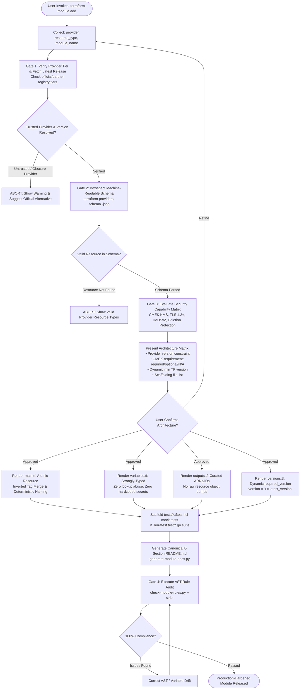

# Terraform Module Builder AI Skill (`terraform-module-builder`)

An industrial-grade, multi-cloud Terraform module engineering platform designed for AI coding assistants (Google Antigravity, Anthropic Claude, Cursor AI, Kiro, Codex, etc.) and human DevOps platform engineers.

This skill equips an AI agent to research official provider schemas, design, scaffold, audit, document, test, refactor, and release production-hardened Terraform modules across **AWS**, **Azure**, **Google Cloud Platform (GCP)**, and **Kubernetes**.

---

## 1. Quick Start & Unified Command Suite

All module lifecycle operations are driven through the unified **`terraform-module`** command suite:

```bash
# 1. End-to-End Module Creation (Schema introspection, capability audit, HCL, tests, docs)
terraform-module add <provider> <resource_type> <module_name>

# 2. End-to-End Upgrade & Modernization (Latest provider, AST moved.tf generation, SemVer)
terraform-module update <module_path>

# 3. Read-Only Compliance & Security Audit (AST linter, tag clobber risks, dead variables)
terraform-module audit <module_path_or_repo> [--strict]
```

> [!IMPORTANT]
> **Interactive Guardrails**:
> - **Invoked bare or ambiguously?** The skill halts, displays the 3 workflows above (`terraform-module add`, `terraform-module update`, `terraform-module audit`), and prompts you to select one.
> - **Missing mandatory arguments?** The skill prompts you specifically for the missing input(s) rather than rejecting your request.

---

## 2. Core Architecture & Non-Negotiable Standards

### 2.1. Always Latest Official/Partner Provider Versions
- **Trusted Provider Tiers**: Production modules strictly consume providers in the `official`, `partner`, or `partner-premier` tiers per the Terraform Registry.
- **Latest Version Enforcement**: When creating (`terraform-module add`) or modernizing (`terraform-module update`), the skill dynamically resolves and targets the latest available stable provider release (`version = ">= <latest>"`).
- **No Upper Bounds in Child Modules**: Child modules declare minimum bounds only (`version = ">= 6.64.0"`), omitting artificial upper constraints (`< 7.0.0`) so consumer stacks maintain upgrade flexibility.

### 2.2. Capability-Aware Security Model (No "KMS Everywhere" Fallacy)
Never enforce blanket security rules where cloud APIs do not support them. The skill evaluates resources against a 6-tier capability taxonomy:

| Capability Tier | Definition | Examples |
|---|---|---|
| **`required`** | Mandatory encryption, logging, or deletion protection. | S3, RDS, Secrets Manager (`kms_key_arn`) |
| **`recommended`**| Production default enabled with caller opt-out override. | S3 Bucket Versioning, VPC Flow Logs |
| **`optional`** | Advanced or niche opt-in features. | S3 Object Lock, RDS Cross-Region Replication |
| **`provider_managed`**| Rely on cloud provider default without redundant blocks. | CloudWatch Log Group standard encryption |
| **`not_supported`** | Cloud API lacks capability; never invent synthetic variables. | Route Table associations, Internet Gateways |
| **`not_applicable`**| Architectural pattern does not apply. | IAM Roles, Security Group Rules |

### 2.3. Strict API Contracts (Zero `lookup()` Object Abuse)
- **Mandatory Attributes**: Every variable declares explicit `description` and `type` constraints.
- **Strongly-Typed Structural Objects**: Complex objects use `optional(type, default)`. Dynamic `lookup()` on typed objects is **strictly banned**.
- **Zero Default Credentials**: Never provide default passwords, tokens, or mock secrets in variable definitions.

### 2.4. Resource-Specific Naming & Tag Governance
- **Deterministic Naming**: `${var.application}-${var.environment}-${var.name}` with cloud-specific limit handling (e.g. AWS ALB 32-character maximum with deterministic MD5 hash truncation).
- **Inverted Tag Merge Law**: Governance tags are merged **after** user-supplied tags:
  ```hcl
  tags = merge(var.tags, local.governance_tags)
  ```
  This prevents consumers from clobbering mandatory enterprise audit tags (`Application`, `Environment`, `Name`, `ManagedBy`).

### 2.5. Zero-Destruction State Migrations
- Any refactor that renames resources, decomposes files, or converts `count` to `for_each` **must** append `moved` blocks into `moved.tf`.
- Historical `moved` blocks are preserved permanently to protect consumer upgrades.
- Speculative plans must assert **0 unexpected deletions**.

### 2.6. Absolute Brand & Project Neutrality
- Reusable modules are 100% project-neutral. Zero internal project names, company names, or brand labels across HCL code, locals, defaults, tags, documentation, or diagrams.

---

## 3. End-to-End Walkthrough: Creating a Production Module

When creating a new module (`terraform-module add`), the skill runs through strict pre-flight validation gates before writing code.

### 3.1. Inputs & Derivation Matrix

| Parameter | Type | Source | Mandatory? | Derivation & Pre-Flight Validation Logic | Confirmation Required? |
|---|---|---|:---:|---|:---:|
| **`provider`** | String | **User** | **YES** | Cloud provider (e.g. `aws`, `azurerm`, `google`). Verified against official/partner tier. | **Yes** |
| **`resource_type`** | String | **User** | **YES** | Primary resource type (e.g. `aws_sqs_queue`, `aws_rds_cluster`). Probed in schema. | **Yes** |
| **`module_name`** | String | **User** | **YES** | Canonical module directory name (e.g. `sqs`, `rds-cluster`). Validated for neutrality. | **Yes** |
| **`provider_version`**| String | **Skill** | *Auto* | Dynamically resolved latest stable release from Terraform Registry. | Displayed in table |
| **`min_tf_version`** | String | **Skill** | *Auto* | Dynamically calculated from features: `>= 1.6.0` (tests), `>= 1.10.0` (ephemeral), `>= 1.11.0` (write-only). | Auto-resolved |
| **`cmek_requirement`**| Enum | **Skill** | *Auto* | Evaluated via Security Capability Matrix: `required` for S3/RDS, `not_applicable` for IAM. | Displayed in table |
| **`governance_tags`** | Map | **Skill** | *Auto* | Standard audit tags (`Application`, `Environment`, `Name`, `ManagedBy`) via inverted merge. | Displayed in table |
| **`test_suites`** | List | **Skill** | *Auto* | Scaffolds native mock tests (`tests/*.tftest.hcl`) and integration suites (`test/*.go`). | Displayed in table |

### 3.2. Pre-Flight Verification Gates

1. **Trusted Provider & Version Resolution Gate**:
   - Validates that the provider belongs to `official`, `partner`, or verified community tiers.
   - Resolves latest stable release version from the registry.
   - **ABORTS** on obscure, unmaintained, or untrusted community providers.
2. **Schema & Argument Introspection Gate**:
   - Executes `terraform providers schema -json` to inspect official argument schemas.
   - Distinguishes required, optional, computed, sensitive, and write-only (`_wo`) arguments.
   - **ABORTS** if requested resource does not exist in the target provider.
3. **Security Capability Matrix Gate**:
   - Evaluates Customer-Managed Key (CMEK) encryption, TLS 1.2+, IMDSv2, and deletion protection against cloud API capabilities.
   - Enforces explicit `kms_key_arn` for all data-at-rest services.
   - **ABORTS** on synthetic security parameters for resources lacking native support.
4. **Project & Brand Neutrality Gate**:
   - Scans proposed module paths, variable defaults, locals, and documentation for internal brand names.
   - **ABORTS** if proprietary company or project names are detected.
5. **Zero-Destroy State Migration Gate** (for `terraform-module update`):
   - Compares working tree AST with git baseline using `detect-migrations.py`.
   - Generates `moved.tf` blocks for renamed addresses.
   - Speculative plan must confirm **0 unexpected deletions**.

### 3.3. Step-by-Step Module Engineering Workflow

1. **Schema & Capability Introspection**:
   - Resolves latest provider release and dumps `terraform providers schema -json`.
   - Classifies arguments into Tier 1 (Security/CMEK), Tier 2 (Production Best Practices), Tier 3 (Provider Defaults), and Tier 4 (Advanced/Edge).
2. **Architecture & Parameters Confirmation Gate**:
   - Displays proposed inputs, derived versions, CMEK requirements, and module path to user.
   - Prompts for user confirmation before scaffolding.
3. **Decomposed HCL Scaffolding**:
   - `versions.tf`: Pins minimum provider version (`version = ">= <latest>"`) and dynamic `required_version`.
   - `main.tf`: Clean, decomposed resource blocks with deterministic naming and inverted tag merges.
   - `variables.tf`: Strongly-typed structural objects with `optional(type, default)`. Zero `lookup()` abuse.
   - `outputs.tf`: Curated IDs, ARNs, endpoints, and structured maps.
4. **Canonical 8-Section `README.md` Scaffolding**:
   - Generates production documentation via `generate-module-docs.py` including Requirements, Providers, Modules, Resources, Inputs, Outputs, Security Baselines, and Usage.
5. **Testing Suite Scaffolding**:
   - Scaffolds native `tests/*.tftest.hcl` using `mock_provider` for fast offline unit validation.
   - Scaffolds Terratest idempotency test suite (`test/*.go`).
6. **Compliance & Static Rule Audit**:
   - Executes `check-module-rules.py --strict` to verify 100% compliance across compatibility, unwired variables, tag clobber risks, and brand neutrality.

---

## 4. Flow Diagram: End-to-End Module Creation (`terraform-module add`)



---

## 5. Flow Diagram: Module Upgrade & Modernization (`terraform-module update`)

```mermaid
flowchart TD
    StartUpdate([User Invokes: terraform-module update]) --> InputPath[Collect: module_path]

    %% Gate 1: AST Diff & Breaking Change Analysis
    InputPath --> RunDiff[Gate 1: Compare Working Tree against Git Baseline<br/>detect-migrations.py --compare-ref HEAD]
    RunDiff --> ChangeCheck{Breaking API Changes Detected?}
    
    %% AST Refactoring & State Safety
    ChangeCheck -- Renamed Resources / Address Changes --> GenMoved[Scaffold moved.tf Blocks<br/>detect-migrations.py --scaffold-move]
    ChangeCheck -- Variable Defaults Changed / Removed --> FlagBreaking[Emit SemVer Classification: MAJOR<br/>Flag breaking input changes]
    ChangeCheck -- Additions / Non-Breaking --> FlagMinor[Emit SemVer Classification: MINOR / PATCH]

    GenMoved & FlagBreaking & FlagMinor --> BumpProvider[Bump versions.tf Provider to Latest Release<br/>Recalculate dynamic required_version]
    BumpProvider --> ModernizeHCL[Modernize HCL Syntax:<br/>• Replace legacy lookup() with optional()<br/>• Enforce inverted tag merge]
    ModernizeHCL --> RefreshDocs[Refresh README.md Tables<br/>generate-module-docs.py]
    RefreshDocs --> RunFmt[Execute: terraform fmt -recursive & tflint]
    RunFmt --> SpecPlan[Gate 2: Run Speculative Plan<br/>Assert 0 Unexpected Resource Destructions]
    SpecPlan --> PlanCheck{Zero Unexpected Destroys?}
    PlanCheck -- Destructive Plan --> ReviewSafety[ABORT: Demand Missing moved.tf Block]
    ReviewSafety --> GenMoved
    PlanCheck -- Safe Plan --> UpdateComplete([Module Modernization Complete & Verified])
```

---

## 6. Strict Human-in-the-Loop Protocol (The 4 Gatekeepers)

```
┌─────────────────────────┐
│ Gatekeeper 1            │ ──> Provider Schema & Version Verification
│ Schema Introspection    │     (Resolve latest provider version; inspect schema JSON)
└───────────┬─────────────┘
            │
┌───────────▼─────────────┐
│ Gatekeeper 2            │ ──> Security Capability & Architecture Confirmation
│ Capability Audit        │     (CMEK KMS evaluation, TLS 1.2+, tag merge law -> User Confirms)
└───────────┬─────────────┘
            │
┌───────────▼─────────────┐
│ Gatekeeper 3            │ ──> Staged Scaffolding & Speculative Plan Gate
│ Staged Generation       │     (Render decomposed HCL, canonical README, run test mocks)
└───────────┬─────────────┘
            │
┌───────────▼─────────────┐
│ Gatekeeper 4            │ ──> Compliance Audit & SemVer Sign-Off
│ Compliance & Sign-Off   │     (Run check-module-rules.py --strict -> Final User Sign-Off)
└─────────────────────────┘
```

---

## 7. Multi-Cloud Security Capability Matrix

The skill evaluates resource security against proven cloud capabilities:

| Cloud Provider | Service Domain | CMEK KMS Encryption | Network Isolation | IMDSv2 / TLS | Deletion Protection |
|---|---|:---:|:---:|:---:|:---:|
| **AWS** | **S3 Buckets** | **`required`** (`kms_key_arn`) | Public Access Block | TLS 1.2+ Enforced | Versioning + MFA |
| **AWS** | **RDS PostgreSQL** | **`required`** (`kms_key_id`) | `intra_subnet_ids` only | SSL/TLS Enforced | Enabled in `prod` |
| **AWS** | **EKS Clusters** | **`required`** (Envelope KMS) | Private Endpoint | TLS 1.3 Control Plane | Protected Node Groups |
| **AWS** | **ECS Tasks** | **`required`** (CloudWatch KMS) | `private_subnet_ids` | IMDSv2 Required | Service Termination Protect |
| **AWS** | **Secrets Manager**| **`required`** (`kms_key_id`) | PrivateLink VPC Endpoint | TLS 1.2+ Enforced | Automatic Rotation |
| **Azure** | **Storage Account**| **`required`** (Key Vault CMEK)| Private Endpoints | TLS 1.2+ Enforced | Soft Delete Enabled |
| **Azure** | **PostgreSQL Flex**| **`required`** (Key Vault CMEK)| VNet Delegated Subnet | SSL/TLS Enforced | High Availability |
| **GCP** | **Cloud Storage** | **`required`** (Cloud KMS) | Uniform Bucket Level | TLS 1.2+ Enforced | Retention Policies |
| **GCP** | **Cloud SQL** | **`required`** (Cloud KMS) | Private Services Access | SSL/TLS Enforced | Deletion Protection |
| **K8s** | **Secrets** | **`provider_managed`** | NetworkPolicy Egress | TLS Ingress Termination | SealedSecrets / Vault |

---

## 8. Automated Tooling Engine CLI Reference

The skill includes a suite of deterministic automation scripts in `scripts/`:

```bash
# 1. Audit a module for P0/P1/P2 issues (compatibility, dead variables, tag clobber risks):
python3 skills/terraform-module-builder/scripts/check-module-rules.py terraform-modules/modules/aws/security/secrets-manager

# 2. Run module audit with strict enforcement (fails on P0, P1, and P2 warnings):
python3 skills/terraform-module-builder/scripts/check-module-rules.py terraform-modules/modules/aws/compute/ecs --strict

# 3. Check for documentation drift in CI:
python3 skills/terraform-module-builder/scripts/generate-module-docs.py terraform-modules/modules/aws/storage/s3 --check

# 4. Generate or refresh module canonical 8-section README:
python3 skills/terraform-module-builder/scripts/generate-module-docs.py terraform-modules/modules/aws/storage/s3

# 5. Detect breaking API changes against git baseline:
python3 skills/terraform-module-builder/scripts/detect-migrations.py terraform-modules/modules/aws/storage/s3

# 6. Scaffold an automated moved block into moved.tf:
python3 skills/terraform-module-builder/scripts/detect-migrations.py terraform-modules/modules/aws/storage/s3 \
  --scaffold-move aws_s3_bucket.main aws_s3_bucket.this
```

---

## 9. Directory Layout

```text
skills/terraform-module-builder/
├── README.md                           # Comprehensive skill documentation (this file)
├── SKILL.md                            # Main orchestrator & 3-workflow command dispatcher
├── assets/
│   ├── architecture-template.svg       # Neutral multi-cloud architecture & verification diagram
│   └── architecture-template.png       # High-resolution rendered asset
├── references/
│   ├── module-api-contract.md          # Variable, output, and SemVer specifications
│   ├── naming-standards.md             # Per-resource naming constraints & deterministic truncation
│   ├── naming-conventions.md           # Naming conventions summary and alias
│   ├── security-capability-matrix.md   # Multi-cloud capability-aware security matrices (AWS, Azure, GCP)
│   ├── security-baselines.md           # Security baselines summary and alias
│   ├── testing-strategy.md             # 7-level testing pyramid (L0 to L6) and mock test guides
│   ├── provider-schema-guide.md        # Guide for extracting & consuming terraform providers schema -json
│   ├── state-migration-guide.md        # Zero-destroy refactoring, moved.tf, and plan assertions
│   ├── readme-specification.md         # Canonical 8-section README blueprint (extensible)
│   └── reference-repo-link.md          # Ground-truth mapping to the local reference repository
└── scripts/
    ├── check-module-rules.py           # AST & schema-aware linter (Python 3)
    ├── generate-module-docs.py         # Introspects HCL/schema to generate/update README tables
    └── detect-migrations.py            # AST diff analyzer for moved {} blocks and SemVer classification
```
